# QuickBase/qbui

For developer instructions to setup and run on your local machine see <https://github.com/QuickBase/qbui/blob/master/ui/README.md#instructions-to-run-for-development> for details.

## Install Prerequisites
* [Install and configure the AWS CLI tools for your laptop](https://github.com/QuickBase/aws#getting-an-mfa-enabled-aws-account)
* [Install the Docker for Mac stable channel release](https://docs.docker.com/docker-for-mac/install/)
* __OPTIONAL__: For GUI to view available images and running containers, [install Kitematic](https://github.com/docker/kitematic/releases) from the zip listed here under releases

## Local Code Modifications
For running locally make sure you copy `qbui/ui/server/src/config/environment/local.js.sample` to `qbui/ui/server/src/config/environment/local.js`

## Local Stack Lifecycle
    NOTE: the commands below assume the ui dist directory is already populated
* Log into ECR: ```eval $(aws ecr get-login --registry-ids 717266932182)``` . This only needs to be done once a day in most cases.
* .env file manages name of Compose project (currently: ui)
* Refer to ```docker-compose.override.yml.sample``` to further explore local overrides to the default Compose environment
* Build the UI image, deploy a container based on that image and also run it: ```docker-compose up -d --build```
* Stop and delete running containers for service: ```docker-compose down```

## Service
* The health check for the UI should be reachable at ```https://localhost:9447/qbui/health``` based on the default port assignment in the Compose YAML file.
* The UI in this deployment can be referred to as 'service' and by container name as 'ui_service_1'. For example: ```docker inspect ui_service_1``` will display information about the deployed service container.

## Logs
* Run ```docker-compose logs service``` to obtain the logs emitted by the UI container on startup
* Run ```docker-compose logs --tail=all -f service``` to tail all of the UI logs live
* Run ```tail -f /tmp/log/docker/ui/service/ui*``` locally to tail the UI logs from the container, as well

## Execute Commands
* Run ```docker-compose exec service ${command}``` (where ${command} is any command) to execute a command inside the service container
** Example: ```docker exec -it core_service_1 /bin/ash``` to open an ash shell inside the core container.

## Run Core, Experience Engine, and Workflow Engine as Dependencies from this Project
2) [Install and configure the AWS CLI tools](https://github.com/QuickBase/aws#aws-cli-and-configuration)
3) Login to ECR (EC2 Container Registry - an Amazon service for storing docker images) using 
the aws CLI by running the follow command in the terminal: `eval $(aws ecr get-login --no-include-email --registry-ids 717266932182)`.
4) Navigate to the QBUI repo on your local machine (e.g., ~/Code/qbui)
1) Create a copy of ```docker-compose.override.yml.sample``` and rename it to ```docker-compose.override.yml``` (remove the .sample at the end).
1) Run `docker-compose pull` in the terminal to get the latest images from ECR. This could take 40+ minutes the first time. Future pulls should only be a few minutes.
2) Run ```docker-compose up -d``` in the terminal. It should bring up Core, Oracle, Experience Engine, Workflow Engine, and PostGres in addition to the existing UI service.
    * **Note:** It sometimes takes Oracle (the database we use for our Core micro-service) a few minutes to boot up the first time. Navigate to `https://localhost:8298/api/swagger-ui.html#!/health-controller/systemCheckUsingGET_1`
    and click "Try it out". You should get a 200 response back. If not, wait a few minutes and try again. If still no luck, or the page isn't loading, you may need to do some additional troubleshooting.
3) Once the full stack of Core, Oracle, Experience Engine, Workflow Engine, and PostGres is running, you can additionally 
run ```docker-compose -f docker-compose.yml -f docker-compose.override.yml -f docker-compose.datagen.yml up -d``` to populate an app with data. Each additional use of this command will restart the 'datagen' container service and create an additional app.
    * Running ```tail -f /tmp/log/docker/datagen/service/ui-sys.log``` is the easiest way to view progress of a data import task.
4) ```docker-compose pause``` is the recommended way to shut down this stack and ```docker-compose unpause``` is the recommended way to start it back up if you want to preserve data for Core and Experience Engine.
    * You can pause just core-db or ee-db by filtering your command as ```docker-compose pause core-db ee-db```
    * Otherwise, run ```docker-compose down``` to destroy it
    
**Tips:**
1) It is a good idea to do a `docker-compose pull` at least daily. That way you are working with the latest code for the backend services.
2) In the QBUI directory, run `docker-compose ps` in the terminal to quickly see which services are up and what ports they are running on. If you find that some services are 
down or not showing up even after running `docker-compose up`, then go to your "Docker for Mac" preferences, click "Advanced", 
and increase the "Memory" to between 6 GB and 8GB (minimum 6 GB). Then try `docker-compose up -d` again.
    
#### Build backend images using your local code

Sometimes, you might want test the UI against a backend that is not on the master branch or perhaps you've made some changes to those
other services you want to test out.

To build custom backend images follow the directions above with a few changes:
1. Create a copy of `docker-compose.override.local.yml.sample` and rename it to `docker-compose-override.local.yml` (remove the .sample)
2. Check the `context` for each of the services. It should point to the respective repos on your local machine relative to the Qbui directory.
If you have the Qbui, QuickBase, ExperienceEngine, etc., repos all in the same folder, then you probably don't need to change anything.
3. Make sure you have built the `war` files for each of the services. It is usually the command `gradle clean build -xTest` within each of those services.
4. Run `docker-compose -f docker-compose.yml -f docker-compose.override.local.yml up --build -d` to bring up the services. That `-f` flag will tell docker-compose
to use your `.local` file instead of the `docker-compose.override.yml` file.

**Note:** If you switch branches or make code changes in any of those backend services, you will need to rebuild the `war` file and the docker images. 


## Run the Service in Docker Compose from IntelliJ
### Prerequisites
* [IntelliJ 2017.1.1](https://www.jetbrains.com/idea/download/)
* [Docker Plugin for IntelliJ](https://www.jetbrains.com/help/idea/2017.1/docker.html)

The following walkthrough will explain to set up a 'Run' config that uses Docker Compose for the deployment of code from IntelliJ
1) The first step is configure the Docker plugin for IntelliJ to attach it to the Docker for Mac Docker server. Copy the exact configuration as shown below to bind a socket connection from IntelliJ to the Docker server.

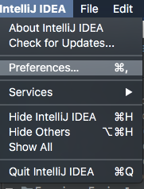

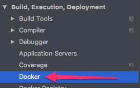

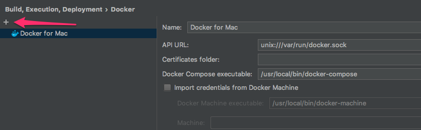

2) Create a new Docker Deployment item and configure as shown. Make sure to pick the correct ```docker-compose.yml```
for this deployment (the QBUI YAML file).

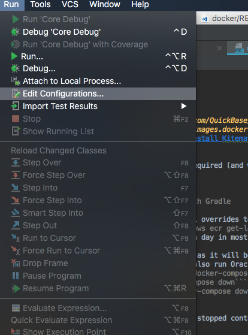

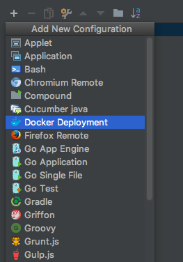

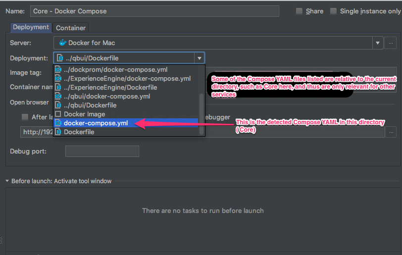

3) The Run configuration can now be launched with the command ```Ctrl + Alt + R``` or the Run button in the IDE. Note: this example is for
Core but functions the same way for the UI run configuration

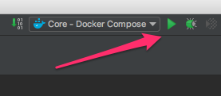

5) The Run configuration will launch a build with logs, then show log output from the deployment. To view the running containers
at the Docker service, use this button to connect to the running Docker server from Docker for Mac.

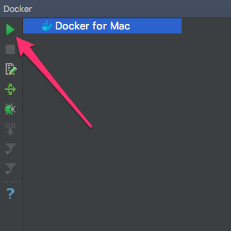

6) To kill the deployment, use this button to 'Undeploy' it.

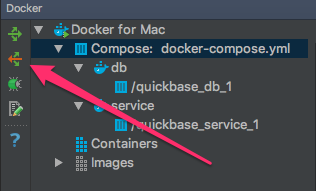

## Debug the Service Running in Docker Compose from IntelliJ
The direction below explain how to attach a remote debugger to NodeJS running in the Docker container for the UI service.

1) Create a new Run/Debug Remote configuration and configure as shown. Make sure the remote debugger port specified matches what is mapped to your host machine in the ```docker-compose.yml``` file.

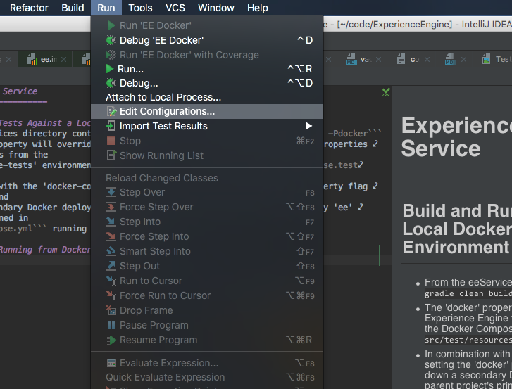

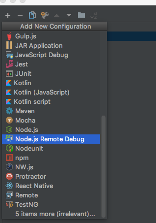

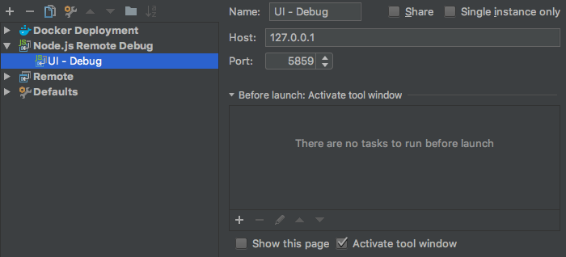

2) If it is not already running, bring up the Docker Compose environment as explained earlier in this README.

3) Run the newly created Run configuration from IntelliJ with the Debug command

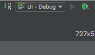

4) The debugger console should pop up and show a similar message to the image below that confirms the remote debugger
is attached.
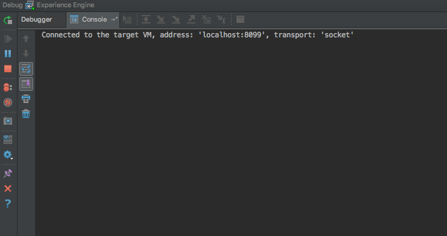

5) A breakpoint can now be attached to any source code that requires debugging, and when the code is executed at that
breakpoint, the debugger should swap to the frame view as it normally would for local debugging. All other functionality
for debugging should now work identically to any prior workflow (watches, stepping, etc).
