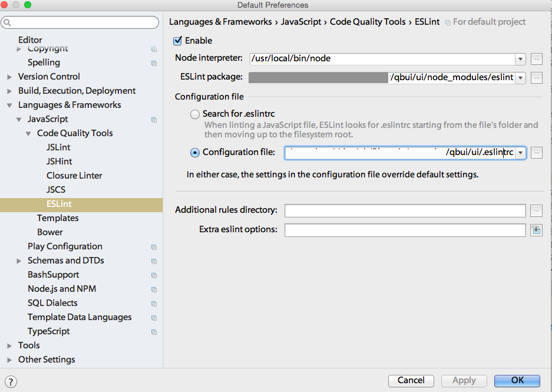
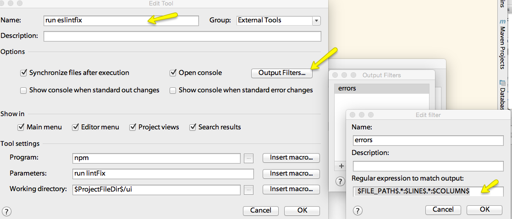
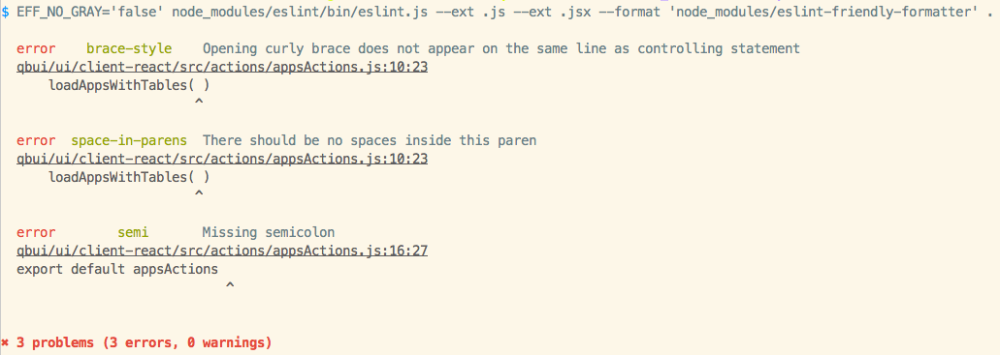

#QuickBase UI

The QuickBase ui project is the ui layer of the QuickBase application. It is an Node.js pass thru API server to the java backend as well as a React frontend.

Other repos for QuickBase:

* [java backend](https://github.com/QuickBase/QuickBase)
*  and [aws](https://github.com/QuickBase/aws)
are also part of the Quickbase application.

see also:
[QBUI project File structure](FILESSTRUCTURE.md)


##Knowledge Prerequisites
Writing Javascript, Node.js, React


##Pre-installation

FIRST - Do all the Quickbase java backend development [setup instructions](https://github.com/QuickBase/QuickBase/blob/master/README.md) so that you have installed

* Git & SourceTree Source code control
* Intellij IDE
  * Install some IntelliJ plugins if you don't have these already
    * React-templates
    * GitHub
    * NodeJS - ui web server plugin
    * SASS support - enhances css with variables and methods plugin
  * Known working versions of Intellij are 14.1.2 and 14.1.4
  * Use the QuickBase/intelliJSettings.jar from the Quickbase project.
* Java and Tomcat to run the backend

##Installing

To avoid permission issues caused by installing npm modules globally, you can either 1) [install NVM](https://github.com/QuickBase/qbui/blob/master/ui/README.md#install-node-via-nvm) (on Mac) OR 2) [install node and configure](https://github.com/QuickBase/qbui/blob/master/ui/README.md#install-node-and-configure-global-node-modules) where node installs global npm modules.

#### Install Node via NVM

[NVM](https://github.com/creationix/nvm) only works with Mac but is the easier and cleaner option.
Install NVM (Node Version Manager) via Wget:

```bash
    wget -qO- https://raw.githubusercontent.com/creationix/nvm/v0.32.0/install.sh | bash
```

Next, install Node.js v4.2.2 and set v4.2.2 as your default version of node (as of 2/1/2016, v5.5.0 is not fully tested with qbui).

```bash
    nvm install node 4.2.2 && nvm alias default 4.2.2
```

To verify installation enter `nvm list default` which should print:
```bash
    ->         v4.2.2
```
If nvm and node were successfully installed, skip the next section about installing Node.js and global node configuration.

#### Install Node and configure global node modules

* Install node.js (v4.2.x or higher, as of 2/1/2016, v5.5.0 is not fully tested with qbui) from the [Node.js site](http://nodejs.org/)

* (*Optional*) Make a place for any global node modules and no permission issues

    1. Create a .node folder from command line.

        ``` bash
        mkdir ~/.node
        ```

    2. Adjust your node settings so that the global modules get installed locally for your login.

        ``` bash
        npm config set prefix=~/.node
        ```
          This is required because when you try to install modules globally (npm install -g), npm will install it in /usr/local/    and this will cause permission issues. In order to prevent this, adjust your node settings to install global modules     local for your login.

    3. Add this directory to your PATH.

       ``` bash
       export PATH=$PATH:$HOME/.node/bin
       ```

* Install homebrew if it's not already installed. Test if it's install by running `brew --version` if says not found, install homebrew with:

    ```
        ruby -e "$(curl -fsSL https://raw.githubusercontent.com/Homebrew/install/master/install)"
    ```
* Install grunt with npm
    ``` bash
    npm install -g grunt
    npm install -g grunt-cli
    ```

* **qbui** project uses npm as its *package managers* and Grunt as its *task runner*.

    The top level of the project holds the CI Jenkins Gradle related files and the source for the ui is under the ui directory

     Node modules are managed by package.json.

    Grunt tasks are defined in the Gruntfile.js


* Then get the qbui project repo

    ```
    git clone -b master ssh://git@github.com/quickbase/qbui.git
    ```
    or

    ```
    git clone -b master https://github.com/QuickBase/qbui.git
    ```

    *Note:* If you get an error about no developer tools found when executing git, make sure you have xCode from Apple installed (and the cli tools). Go to the AppStore application and [install xcode](http://itunes.apple.com/us/app/xcode/id497799835?ls=1&mt=12).

##Configuring
Environment specific configurations reside in the qbui/ui/server/src/config/environment directory. The application requires a run-time environment to be defined and configured.  

For developing set this environment variable in your bash profile
`export NODE_ENV=local`

By default, the server runs in local development mode, meaning a local configuration file must be defined. As this file is not tracked by git, to run locally, you will need to do the following:

- copy \<project root\>qbui/ui/server/src/config/environment/local.js.sample into the local.js

Notes about the above configuration:

SSL support is commented out.  See the section at the bottom of this README for setup instruction.

Environment variable 'javaHost' points to a local instance rest endpoint.  Change to point to another server instance if not running Quickbase java backend locally.

RUN-TIME configuration.

The following run-time environment variable is supported:

        NODE_ENV: <name of config file>

        For example:

        NODE_ENV=test

        will load the test.js file for configuration, default is local.js


##Instructions to run server and watch for changes

* `cd` to the \<project root\>qbui/ui directory.

* run 'npm install' to install node modules

* To launch the node web server (express) and it will update server as you make edits run

    * `grunt serve`

* Current urls supported
    * http://localhost:9000/

###Note :
 The Node Server only listen via a specific ip/hostname when running with dev hotloader,
 as the hotload server needs the ip of main express server. When running in production mode listen is just scoped to port, not ip.node -

## Testing
cd to <project root>/qbui/ui directory
###Lint and Code Style tests
Running `grunt codeStandards` from will run the lint tasks. This task validates the javascript follows best practices and ensures the code is formatted to our qbui coding styles.

* Linting check [ESLint](http://eslint.org/docs/rules/) -
    Look at the .eslintrc files for the lint rules and coding standards
    and set the following settings for coding style errors to appear in the IDE inspection. (This step is manual due to difference user code paths)


    *  In the qbui Intellij project, go to Main Menu `Intellij IDEA/Preferences...` or `File/Other Settings... /Default Settings...` and then select the options for `Languages & Frameworks` then `Code Quality Tools` then `Javascript` and disable all the others but enable ESLint and set the following ESLint settings

    *  ESLint dialog
        * 
    * Note: The lint and coding standards settings are found in `.eslintrc` file(s). Each directory can overide the general settings with its own .eslintrc file or in line a file can specify `/* eslint rule:value */` to override with comment statements.
    * The rules are based on several standards see [https://github.com/jscs-dev/node-jscs/tree/master/presets](https://github.com/jscs-dev/node-jscs/tree/master/presets)  as well as data from statistics on github open source code [http://sideeffect.kr/popularconvention#javascript](http://sideeffectkr/popularconvention#javascript

    * The ESLint setup in the above dialog will now run eslint with the Intellij `Analyze\Inspect Code...` feature and while you edit it will show errors in the left margin in red.

    * ESLint is part of the build and build will fail if there are errors.

    * The script to run eslint from the command line is `NODE_ENV=local npm run lint` or to fix the stylistic [fixable errors][http://eslint.org/docs/rules/) run `NODE_ENV=local npm run lintFix` our build does lintFix. The lint npm script runs ` node_modules/eslint/bin/eslint.js --ext .js --ext .jsx --format 'node_modules/eslint-friendly-formatter' .`


    * Also to run the eslint on the source from Intellij *custom tool* with clickable links to error location, do the following
        1. Create a external tool (`IntelliJ\Preferences...\Tools\Exterenal Tools`) to run eslint using this
           - program: `npm`
           - parameters: `run lintFix`
           - working directory: `$ProjectFileDir$/ui`

        2. Use an output filter like:

           ```bash
             $FILE_PATH$.*:$LINE$.*:$COLUMN$

           ```
           * For Example 

        3. When launching the tool now any eslint errors listed which have file location will be also clickable. Clicking will take you to the error location in the Intellij editor:
           


###Unit tests
Running `grunt test` will run the client and server unit tests with karma and mocha as well as the codeStandards.

Use `grunt test:server` to only run server tests.

Use `grunt test:client` to only run client tests.

Note: If you see a `Cannot find module './build/Release/DTraceProviderBindings'] code: 'MODULE_NOT_FOUND'` in the log from unit test run ` npm install bunyan ` to fix


###Mocha Integration tests

In order to run the integration tests you will need to have your Node.js express server and your Java API service running

Make sure you have configured your local.js file properly (as described above):

        //REST endpoint (protocol,server,port)
        javaHost: 'http://localhost:8080'
        //Express Server
        DOMAIN: 'http://localhost:9000'


Because the integration tests create a realm and the Mac OS by default does not handle loopback calls to localhost, we need to setup / configure
a local DNS server (Dnsmasq):


        # Update your homebrew installation
        brew up
        # Install Dnsmasq
        brew install dnsmasq

        # Copy the default configuration file:
        mkdir -p /usr/local/etc && cp $(brew list dnsmasq | grep /dnsmasq.conf.example$) /usr/local/etc/dnsmasq.conf

        # Copy the daemon configuration file into place:
        sudo cp $(brew list dnsmasq | grep /homebrew.mxcl.dnsmasq.plist$) /Library/LaunchDaemons/

        # Start Dnsmasq automatically when the OS starts:
        sudo launchctl load /Library/LaunchDaemons/homebrew.mxcl.dnsmasq.plist

        #if you ever need to unload it use
        sudo launchctl remove homebrew.mxcl.dnsmasq
        sudo launchctl unload /Library/LaunchDaemons/homebrew.mxcl.dnsmasq.plist


Configure Dnsmasq: The configuration file lives at `/usr/local/etc/dnsmasq.conf` by default, so open this file in your favourite editor. Add or uncomment this line in config file:

        address=/localhost/127.0.0.1

        # Restart Dnsmasq:
        sudo launchctl stop homebrew.mxcl.dnsmasq
        sudo launchctl start homebrew.mxcl.dnsmasq

At this point Dnsmasq is being used for all DNS requests. We want to configure the Mac OS to just use Dnsmasq for localhost callbacks:

        sudo mkdir -p /etc/resolver
        sudo tee /etc/resolver/localhost >/dev/null <<EOF
        nameserver 127.0.0.1
        EOF

For more documentation on Dnsmasq see: `http://passingcuriosity.com/2013/dnsmasq-dev-osx/`

To make sure it's working properly run java backend and in your web browser hit:
`http://blah.localhost:8080/api/`
If swagger comes up then Dnsmasq is configured properly.

Now try to hit an external website like `http://www.google.com` to make sure the OS is handling non localhost calls.

Now you should be able to run your Mocha integration tests!
With the Java API service running, from the qbui/ui directory run:

        export NODE_ENV=local
        grunt mochaTest:integration

Note that this command will launch your Node express server if it's not running.

###Protractor E2E tests

To setup protractor e2e tests, you must first run

`npm run update-webdriver` from the qbui/ui directory

Edit and configure your own copy of e2e.js located in qbui/ui/server/config/environment if needed.

Use `grunt test:e2eLocal` to have protractor go through tests located in the `e2e` folder. You will need to have both your local node server
and your java server running.

See [Debugging UI](./DEBUGGING.md)

To connect to an aws swimlane to run your tests from your local, run

`grunt test:e2e --baseUrl=<the url you want to hit> --sauceKey=<the credentials for our sauceLabs account>`

The credentials for the sauceLabs account can be found in the Jenkins job 'AWS_Pipeline-Run_UI_E2E_Tests'

For more information on sauce visit: https://docs.saucelabs.com/

To configure protractor to use different browsers, modify or add a file to the protractor configuration under qbui/ui/e2e/config.

For all of the browser capabilities check out:

http://www.ignoredbydinosaurs.com/2015/04/angular-protractor-tests-and-sauce-connect-config
and
https://www.browserstack.com/automate/capabilities

##Using Gradle to build distribution node server
Gradle is used to build a production version of the node server and client application.

Output from the Gradle Build and Test task is saved under the /build folder.

Supported Gradle tasks include:

        gradle build - cleans dist and build folder; builds deployable code in dist folder; runs unit tests; runs code coverage; creates zip file.
        gradle clean - cleans gradle build folder AND grunt dist folder
        gradle test  - cleans dist folder; runs unit tests; runs code coverage.  Equivalent to 'gradle clean test'
        gradle (default) - equivalent to 'gradle clean test build'

To run a gradle task, cd to the dist dir and run:

        `npm install --production`

        which will install all the necessary modules for the release in node_modules under dist.
        NOTE: using --production will not include all the development node_modules needed to build/compile/compress/test the code.

To run the production distribution node server, run one of the following (may need sudo):

        NODE_ENV=aws PORT=9000 node server/app.js
        NODE_ENV=aws PORT=9000 npm start

##Running with Forever
To start a node server with forever which ensures that a given node script runs continuously:

        NODE_ENV=aws PORT=9000 node_modules/forever/bin/forever start server/app.js

To stop a running node server with forever:

        NODE_ENV=aws PORT=9000 node_modules/forever/bin/forever stop server/app.js

add forever option -w to automatically restart server on change to js files
other forever options
    -l  LOGFILE      Logs the forever output to LOGFILE
    -o  OUTFILE      Logs stdout from child script to OUTFILE
    -e  ERRFILE      Logs stderr from child script to ERRFILE

##Running NODE UI server code with SSL
By default, the express server will only accept http requests. To also accept https requests, the following setup is required.

CREATE CERTS:

The two files you need are a PEM encoded SSL certificate and private key.

If you already have a certificate(self-signed is okay) in your local keystore for the express server CommonName (ie: localhost, localhost.com, etc),
you can create the files from your local keystore.
For more information, click [here](http://security.stackexchange.com/questions/3779/how-can-i-export-my-private-key-from-a-java-keytool-keystore):

  a) Import your keystore into PKCS#12 (.p12) files:

    keytool -importkeystore -srckeystore yourKeyStore.jks -destkeystore keystore.p12 -deststoretype PKCS12 -srcalias <jkskeyalias> -deststorepass <password> -destkeypass <password>

    NOTE: srcalias is an optional parameter. If omitted, then all entries are imported.  It's recommended to import only the alias associated with your CN.

  b) Export your certificates(cert.pem):

    openssl pkcs12 -in keystore.p12  -nokeys -out cert.pem

  c) Export your private key(private.pem):

    openssl pkcs12 -in keystore.p12  -nodes -nocerts -out private.pem


If you do not have a certificate, you'll need to generate a private key and a certificate signing request, or CSR (which also contains your public key).
The following highlights how to do so using OpenSSL.
For more information, click [here](http://stackoverflow.com/questions/12871565/how-to-create-pem-files-for-https-web-server)

  a) Create a certficate signing request and private key:

    openssl req -newkey rsa:2048 -new -nodes -keyout private.pem -out csr.pem

    You will enter an interactive prompt to generate a 2048-bit RSA private key and a CSR that
    has all the information you choose to enter at the prompts. (Note: Common Name is where you'll want to
    put the domain name you'll be using to access your site.)

  b) Generate a self-signed certificate (the below expires in 10 years):

    openssl req -newkey rsa:2048 -new -nodes -x509 -days 3650 -keyout private.pem -out cert.pem

LOCALHOST CONFIGURATION

Caution should be taken with your private key. The following highlights a recommended approach as to how a developer's localhost
environment could be configured.  How other run-time environments like QA, E2E and PROD/AWS are configured/implemented will most likely differ
based on the security requirements of each.

  a) Copy the certificate(cert.pem) and private key(private.pem) to the 'keys' folder within the project.  The path is:

     ../quickbaseui/ui/server/src/config/keys

     NOTE: this is a new folder intended to hold run-time environments certs.  Given the sensitive nature of the content, other than the
     .gitignore file, all files put into this folder are not tracked by git.

  b) Modify the local.env.js file to define the path where your private key and certificate is located:

    SSL_KEY: {
        private: path.normalize(__dirname + '/keys/private.pem'),
        cert: path.normalize(__dirname + '/keys/cert.pem'),
        requireCert: false  // set to false for self signed certs
    },

  c) Modify the local.env.js file to change the default port for SSL.  Currently, it is set to 9443.  You can override as follows:

    sslPort: 9988,


Start up your express server.  In the console, you should see that the server is listening on both the http port(9000) and https port(9443).
Open a browser to verify.

To stop or not accept SSL requests, comment out/remove the SSL_KEY object in your run-time environment configuration file...(ie: local.env.js).


##Access REST endpoints over SSL
Update the javahost run-time configuration parameter to use the https protocol and appropriate port.  For example, include the following
setting in the local.env.js file:

    //REST endpoint (protocol,server,port)
    javaHost: 'https://localhost.com:8443'


##Troubleshooting
POSSIBLE ISSUES -- and how to resolve

1. First, since the ui has dependencies on the java backend make sure:

    1.1. your Tomcat server is running

    * see [Quickbase repo](https://github.com/QuickBase/QuickBase/raw/master/README.md)

    1.2. your Oracle DB is up

    * see [oracle vm setup info](https://wiki.intuit.com/display/qbasepd/Local+Oracle+Linux+VM+Setup)

    1.3. your Node express server is running

    * under this repo ui dir run 'grunt serve'

2. When running unit tests, if the following error is outputted, it means PhantomJS is not installed on your machine:

      INFO [launcher]: Starting browser PhantomJS
      ERROR [launcher]: No binary for PhantomJS browser on your platform.
        Please, set "PHANTOMJS_BIN" env variable.

   Though the package definition is included in the package.json, to correct, open a command window, cd to the project folder and
   manually install by running:

      npm install karma-phantomjs-launcher

3. If when running your node server you see ECONNREFUSED in the logs make sure you have followed the instructions for the DNS workaround on mac above


##Other Resources

* Links for learning Node, react, etc - [https://github.com/QuickBase/QuickBaseUIProto/blob/development/ui/LEARNING.md]([https://github.com/QuickBase/QuickBaseUIProto/blob/development/ui/LEARNING.md)

* Information on the ui ops tools we use to build and deploy the you - [https://github.com/QuickBase/QuickBaseUIProto/blob/development/ui/TOOLS_AND_LIBS.md](https://github.com/QuickBase/QuickBaseUIProto/blob/development/ui/TOOLS_AND_LIBS.md)

* Globalization in the UI - [https://github.com/QuickBase/QuickBaseUIProto/blob/development/ui/UI%20i18n.md](https://github.com/QuickBase/QuickBaseUIProto/blob/development/ui/UI%20i18n.md)

Contributors
---------------------
+ Chris Deery
+ Claire Martinez
+ Cleo Schneider
+ Don Hatch
+ Ken LaBak
+ Lisa Davidson
+ Mark Roper
+ Micah Zimring
+ Rick Beyer
