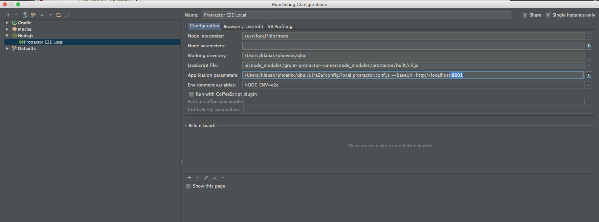

#How to run the E2E Protractor tests and Generate Test Data for the UI

##Pre-requisites:
You need your full local dev stack running - Oracle VM, Tomcat Server, Node Server (launch Node via **NODE_ENV=local npm start** command from the qbui/ui directory).

Check the README.md files in the specific repos for getting these setup. Make sure you check out the qbui react-dev branch from Git to get the latest React UI and working tests.

##Running E2E Protractor tests:
You can run the Protractor tests either via a Grunt command or creating an IntelliJ Node Configuration (your preference).

###Via the command-line (local):
* In the Mac OS X terminal cd to your checked out repository into the **qbui/ui** directory.
* Run the following Grunt command: **grunt test:e2eLocal** (you should see Chrome browser launch and run a few tests)
If you get an error about chromedriver or selenium not being found, run this command from qbui/ui: **npm run update-webdriver**.
This should download you the latest chromedriver and webdriverJS.

If you look in IntelliJ you should see a selenium folder under **qbui/ui/node-modules/grunt-protractor-runner/node_modules/protractor/selenium**
(you can move the folder to this location if the above command put it somewhere else).

###Via IntelliJ Node Configuration (local):
* In IntelliJ select the configuration menu located at the top of the IDE and choose **Edit Configurations**
* Hit the **+** sign in the top left corner and choose new **Node.js** configuration
* Configure it as follows (you will need to edit the paths to where your qbui repo is located)

* Save and close this window when you are finished. You can then click the green **Play** button at the top to run (or debug) your config.

You’ll see the Chrome browser launch and run a few tests. If you get errors check the section above.

###Keep the test data around so you can view it in the UI:
By default we clean up our Oracle database by deleting the test realms once tests finish (either by pass or fail).

There is a single location in the Protractor base class I created where you can turn this off.

* Navigate to **qbui/ui/e2e/common/e2eBase.js** (tip: You can use IntelliJ’s shortcut to find files in a project by pressing the **Command + Shift + N keys**)
* Find the **cleanUp** function (which tells Node to go clean up the test realm we created) and comment it out as follows – see the highlighted section (**make sure you do not comment out the done(); callback function!**)

* Now if you run your tests again the test realms will not be deleted.
* You can then look at your IntelliJ console (or terminal) and search for the **subdomain** (the prefix to your localhost, something like **kensrealm**.localhost:9001, which is also your realm name) and the corresponding **realmId** for that realm.

Note that we currently have two test spec files so a test realm for each will be created.

###Viewing your test data in the UI:
* In your web browser enter the following to generate a session ticket: http://<your realm name>.localhost:9000/api/api/v1/ticket?uid=10000&realmID=<your realm ID> (make sure the subdomain and realmId match!)
* Now in another tab go to http://<your realm name>.localhost:9000/apps/ to see all the apps that were generated in your realm. Now you can choose an app / table / report to see data in the table!

**Remember not to check the commented out function into Git!** Run it a few times and then uncomment it.

As long as you don’t run **db-reset.sql** or **db-cleanup.sql** on your OracleVM you won’t clean out any test data you created above.

Also if you leave it commented out your database will eventually fill up if you run more E2E tests.  

If this happens run the **db-cleanup.sql** script located in the QuickBase (Tomcat) project on your OracleVM (via SQLDeveloper).
