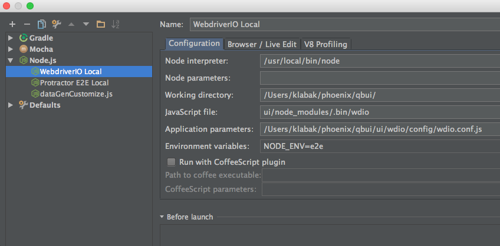

#WebdriverIO README.md Setup Guide
Written by klabak 12/14/16

##Pre-requisites:
You need your full local dev stack running - Oracle VM, Tomcat Server, Node Server (with dnsmasq!).
All node_modules need to be installed and up to date via **npm install** (this will install WebdriverIO automatically for you)

Check the README.md files in the specific repos for getting these setup.

Browser installation: You'll need the latest Chrome version installed on your local dev ENV. If you want to run tests against other browsers you'll need those as well. 

##Overview:
WebdriverIO (wdio) is an E2E test framework that simulates an end user interacting with a UI in a web browser or mobile application. 
It is essentially a wrapper over the WebdriverJS framework which is the Javascript version of Selenium Webdriver.
Wdio has many awesome features for writing tests and interacting with page elements in a simple, concise manner. 
Tests are written synchronously so you don't have to have in-depth knowledge about promises and callbacks.
We will be using the wdio testrunner to manage selenium and run our tests for us. Wdio also has services for interacting with third parties which we will make use of as well.
This guide will help you get wdio setup on your local dev machine.

For more info on WebdriverIO please see their website here: http://webdriver.io/

##Configuration:
The WebdriverIO configuration file contains all the information need to run the test suite locally. 
Things like what spec files and browsers to run can be configured here. The file is located in

```
qbui/ui/wdio/config/wdio.conf.js
```

This config file should be set by default to run your tests locally. The config file will read in environment variables set by your Node server.
By default the E2E tests will launch a Node server automatically using the e2e.js config file on port 9001
(this is to prevent port collision if you have Node already running for manual testing). 

It is here were you need to make sure the values match what your dev env is running at (specifically the **DOMAIN** and **javaHost** properties. The node config file is located in

```
qbui/ui/server/src/config/environment/e2e.js
```

For more on the wdio config file see the page here: http://webdriver.io/guide/testrunner/configurationfile.html

##Running E2E tests:
You can run the E2E tests either by creating an IntelliJ Node Configuration or via the command line (via IntelliJ is preferred since it's MUCH easier to debug).

###Via IntelliJ Node Configuration (local):
* In IntelliJ select the configuration menu located at the top of the IDE and choose **Edit Configurations**
* Hit the **+** sign in the top left corner and choose new **Node.js** configuration
* Configure it as follows (you will need to edit the paths to where your qbui repo is located)




* Save and close this window when you are finished. You can then click the green **Play** button at the top to run (or debug) your config.

You’ll see the Chrome browser launch and run a few tests. If you get errors check the section above.


###Via the command-line (local):
* The wdio config file is set to be run via IntelliJ by default. You'll need to update the **specs** parameter in **wdio.conf.js** first before proceeding:

```
specs: [
        './tests/reportAddRecord.e2e.spec.js'
    ],
```

* In the Mac OS X terminal cd to your checked out repository into the **qbui/ui/wdio** directory.
* Enter the following:

```
NODE_ENV=e2e ../node_modules/.bin/wdio ./config/wdio.conf.js
```

We will be adding a grunt task to handle spec configuration automatically in the future

###Choosing which tests run:

Edit the specs parameter of wdio.conf.js

###Configure your browser and breakpoint size

Edit the capabilities object of wdio.conf.js. Valid browsers are chrome, firefox, safari and valid breakpoint sizes are small, medium, large, xlarge.

```
capabilities: [{
        // maxInstances can get overwritten per capability. So if you have an in-house Selenium
        // grid with only 5 firefox instances available you can make sure that not more than
        // 5 instances get started at a time.
        maxInstances: 5,
        // what browser instance you want to launch
        browserName: 'chrome',
        // Custom variable we use to set the size of the browser
        breakpointSize: 'large'
    }],
```

###Debugging tests
First make sure the debug flag in wdio.conf.js is set to true (should be by default locally)
If you are running wdio via IntelliJ (which you should be) simply put a breakpoint in your code and run your IntelliJ config in Debug mode.

If you are running wdio via the command line you'll need to do a couple extra steps. You'll need to add 

```browser.debug()``` to your code to pause your test

See the guide here:
http://webdriver.io/guide/testrunner/debugging.html

If you hit a Jasmine timeout you'll need to bump the Jasmine **defaultTimeoutInterval** defined in **wdio.conf.js** as specified in the link above.